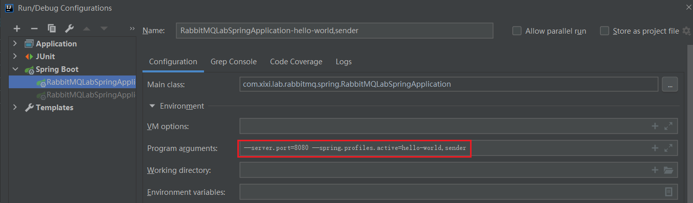
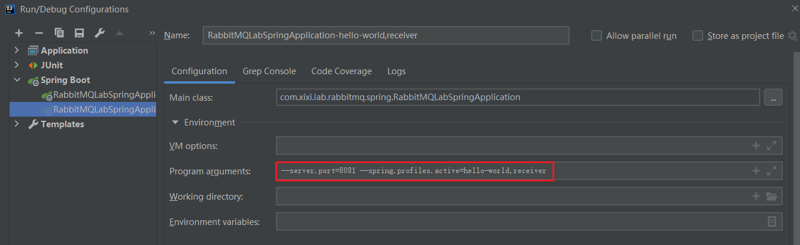
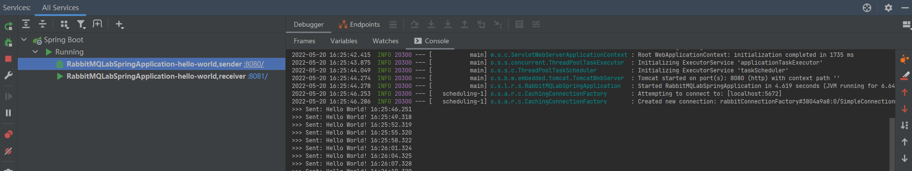
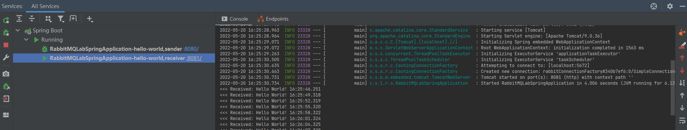
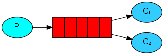

# 0. 简介

本文介绍了 RabbitMQ 七种消息传递模式，并提供了 Java Client 和 Spring Boot 的代码示例，内容及代码主要参考于官网，具体资料可参考本文末尾的参考资料的链接。

1. ["Hello World" 简单模式](https://github.com/sissilab/RabbitMQ-Lab/blob/master/docs/RabbitMQ七种消息传递模式.md#1-hello-world-简单模式)：一个简单的示例程序，一个生产者发布消息，一个消费者监听队列并接收消息。（一个生产者，一个默认交换机，一个队列，一个消费者）
2. **Work queues 工作队列（任务分发）模式**：横向扩展消费者，多个消费者会被轮询分发消息。此外，还介绍了 消息确认、消息持久化、公平分发。（一个生产者，一个默认交换机，一个队列，多个消费者）
3. **Publish/Subscribe 发布订阅模式**：fanout 类型交换机，生产者发布消息，所有绑定的消费者均会收到消息。
4. **Routing 路由模式**：direct 类型交换机，生产者发布消息，交换机通过指定的 `routingKey` 将消息分发给与之绑定的消费者。
5. **Topics 主题模式**：topic 类型交换机，生产者发布消息的 `routingKey` 可为 <u>以点号分割的单词列表</u>，而消费者可通过 `* (星号，匹配一个单词)` 或 `# (井号，匹配大于等于0个单词)` 来模糊匹配 `routingKey`，从而接收到某一主题的消息。
6. **RPC**：通过 RabbitMQ 实现 RPC。
7.  **Publisher Confirms 发布确认模式**：通过将信道设置成 确认（confirm）模式，生产者则可以知晓消息是否已确认，并且可以通过回调方法来处理 ack  和 nack 情况的消息。

Java Client 的 Maven 所需依赖如下：
```xml
<dependency>
  <groupId>com.rabbitmq</groupId>
  <artifactId>amqp-client</artifactId>
  <version>5.7.1</version>
</dependency>
<dependency>
<groupId>org.slf4j</groupId>
<artifactId>slf4j-simple</artifactId>
<version>1.7.26</version>
</dependency>
```

Spring Boot 的 Maven 所需依赖如下：
```xml
<dependency>
  <groupId>org.springframework.boot</groupId>
  <artifactId>spring-boot-starter-amqp</artifactId>
</dependency>
```

# 1. "Hello World" 简单模式

RabbitMQ 是一个消息中间件，它可以接收和转发消息。RabbitMQ 好比一个邮箱、邮局、和邮递员：当你把信投递到邮箱里，可以确信邮递员最终会把你的信送到收信人手里。RabbitMQ 与邮局差别主要在于：RabbitMQ 接收、存储、和转发二进制数据消息。

- **生产者（P，Producer）**：发送消息。
- **队列（Queue，下图红色区域）**：队列好比一个邮箱，它位于 RabbitMQ 内部，用来存储消息。队列的存储空间受限于服务器的内存和磁盘大小，它本质上是一个大的消息缓冲区。多个生产者可以发送消息到队列中，多个消费者也可以从队列中接收消息。
- **消费者（C，Consumer）**：等待从队列接收消息。


下代码示例为：
仅有一个生产者将消息放入 hello-queue 队列中，有一个消费者监听 hello-queue 队列，并将接收到的消息打印出来。
> 一个生产者、一个默认交换机、一个队列（hello-queue）、一个消费者。

## 1.1. Java Client 实现

- **生产者**：将消息放入 hello-queue 队列中
```java
class HelloWorldSend {

    private final static String QUEUE_NAME = "hello-queue";

    public static void main(String[] argv) throws Exception {
        // 1、创建连接工厂
        ConnectionFactory factory = new ConnectionFactory();
        factory.setHost("localhost");
        // 使用 try-with-resources 来创建 Connection，进而创建 Channel
        try (Connection connection = factory.newConnection(); // 2、通过 连接工厂 创建连接 Connection
             Channel channel = connection.createChannel()) { // 3、通过 Connection 创建信道 Channel
            // 4、利用 Channel 声明一个队列（要发送给哪个队列），指定队列名及相应参数（执行此后，即会创建好一个队列）
            /* 参数1 String queue：队列名
             * 参数2 boolean durable：true 设置队列为持久化，会存到磁盘上，MQ服务重启后不丢失；false 不持久化，默认消息存储在内存中，MQ服务重启后会丢失
             * 参数3 boolean exclusive：true 设置队列为排他的，被设置排他的队列仅对首次声明它的连接可见，并在连接断开时自动删除（即使设置了持久化）
             * 参数4 boolean autoDelete：ture 设置队列为自动删除，当至少有一个消费者已连接到该队列，之后该队列连接的所有消费者都断开时，该队列会自动删除
             * 参数5 Map<String, Object> arguments：其他参数
             */
            channel.queueDeclare(QUEUE_NAME, false, false, false, null);
            String message = "Hello World! " + LocalDateTime.now().toString();
            // 5、发布消息（消息需转为 byte[]）至队列中
            /* 参数1 String exchange：交换机名，发布消息到该交换机中，若为空串，则发往MQ默认的交换机中
             * 参数2 String routingKey：路由键，交换机根据routingKey将消息放到对应的队列中
             * 参数3 BasicProperties props：其他属性
             * 参数4 byte[] body：消息体
             */
            channel.basicPublish("", QUEUE_NAME, null, message.getBytes(StandardCharsets.UTF_8));
            System.out.println(">>> Sent '" + message + "'");
        }
    }
}
```

- **消费者**：接收消息，启动后将处于一直监听消息中，当消息到达 hello-queue 队列中，通过回调 `DeliverCallback` 来处理获取到的消息
```java
class HelloWorldRecv {

    private final static String QUEUE_NAME = "hello-queue";

    public static void main(String[] argv) throws Exception {
        // 1、创建连接工厂
        ConnectionFactory factory = new ConnectionFactory();
        factory.setHost("localhost");
        // 2、通过 连接工厂 创建连接 Connection
        Connection connection = factory.newConnection();
        // 3、通过 Connection 创建信道 Channel
        Channel channel = connection.createChannel();
        // 4、利用 Channel 声明一个队列（要发送给哪个队列），指定队列名及相应参数
        channel.queueDeclare(QUEUE_NAME, false, false, false, null);
        System.out.println(" [*] Waiting for messages. To exit press CTRL+C");

        // DeliverCallback 用于缓存发送过来的消息，通过该回调可接收并处理消息
        DeliverCallback deliverCallback = (consumerTag, delivery) -> {
            String message = new String(delivery.getBody(), StandardCharsets.UTF_8);
            System.out.printf("<<<[√] Received '%s', consumerTag=%s\n", message, consumerTag);
        };
        // CancelCallback 消费取消回调
        CancelCallback cancelCallback = (consumerTag) -> {
            System.out.printf("<<<[x] Canceled: consumerTag=%s\n", consumerTag);
        };
        // 5、消费/接收消息，通过回调来处理接收到的消息
        /* 参数1 String queue：队列名，指定消费哪个队列
         * 参数2 boolean autoAck：true 设置为自动确认；false 设置为手动确认，利用 channel.basicAck() 进行手动确认
         * 参数3 DeliverCallback deliverCallback：接收到消息的消费回调
         * 参数4 CancelCallback cancelCallback：消费者取消时的回调（不受channel.basicCancel()影响），如队列被删除（rabbitmqctl delete_queue hello）
         */
        channel.basicConsume(QUEUE_NAME, true, deliverCallback, cancelCallback);
    }
}
```

## 1.2. Spring Boot 实现

- **配置类**：
```java
@Profile("hello-world")
@Configuration
public class Tut1Config {

    public static final String QUEUE_NAME = "hello-spring-queue";

    /**
     * 声明一个队列 hello-spring-queue
     * 当spring.profiles.active为hello-world，即会创建
     */
    @Bean
    public Queue hello() {
        return new Queue(QUEUE_NAME);
    }

    /**
     * 生产者
     * 当spring.profiles.active为hello-world + sender，即会创建
     */
    @Profile("sender")
    @Bean
    public Tut1Sender sender() {
        return new Tut1Sender();
    }

    /**
     * 消费者
     * 当spring.profiles.active为hello-world + receiver，即会创建
     */
    @Profile("receiver")
    @Bean
    public Tut1Receiver receiver() {
        return new Tut1Receiver();
    }
}
```

- **生产者**：注入并利用 RabbitTemplate，来发送消息。利用 @Scheduled 可模拟实现在容器启动后延迟2秒，再每隔3秒调用发布一次消息。
```java
public class Tut1Sender {

    @Autowired
    private RabbitTemplate template;

    @Autowired
    private Queue queue;

    /**
     * 在容器启动后延迟2秒，再每隔3秒调用发布一次消息
     */
    @Scheduled(fixedDelay = 3000, initialDelay = 2000)
    public void send() {
        String message = "Hello World! " + LocalTime.now().toString();
        template.convertAndSend(queue.getName(), message);
        System.out.println(">>> Sent: " + message);
    }
}
```

- **消费者**：通过注解 @RabbitListener 设置监听的队列，搭配注解 @RabbitHandler 来接收消息，并打印出消息。
```java
@RabbitListener(queues = Tut1Config.QUEUE_NAME)
public class Tut1Receiver {

    /**
     * 接收消息回调
     *
     * @param msg
     */
    @RabbitHandler
    public void receive(String msg) {
        System.out.println("<<< Received: " + msg);
    }
}
```

以上代码为 Spring Boot 实现方式，为了模拟生产和消费程序，以 IDEA 工具为例，新增2个 Spring Boot 启动配置，并通过设置 Program arguments 来分别启动生产者和消费者程序。通过 `--spring-profiles-active` 实现加载所配置的类，以达到区分生产者和消费者程序的目的。

- 生产者的启动配置：
  

- 消费者的启动配置：
  

输出结果：
- 生产者的输出：
  

- 消费者的输出：
  

# 2. Work queues 工作队列（任务分发）模式

只有一个消费者，所有的消息都只有分发到那个唯一的消费者去处理，本节将增加多个消费者，一起来承担生产者发出的消息。工作队列（Work Queues）模式，又叫任务队列，可以将消息分发给多个消费者来处理，面对大量资源任务时，可横向扩展消费者，并行执行任务。
> 一个生产者、一个默认交换机、一个队列（work-queue）、两个消费者。



本节主要内容为：
- **[轮询分发](https://github.com/sissilab/RabbitMQ-Lab/blob/master/docs/RabbitMQ七种消息传递模式.md#21-java-client-实现)**：多个消费者的工作队列模式，采用自动消息确认，生产者发布的所有消息会按序分发（平均分配）给每一个消费者，若面临大量消息处理的需求，可横向扩展消费者数量，提升处理效率。但是当某个消费挂掉后，当前该消费者正处理的消息和已分发未处理的消息都会被丢弃。
- **[[#^835ae3|消息确认]]**：若为自动消息确认，当消费者挂掉，消息也会丢失；当为手动消息确认，消费者完成处理消息后再发出消息确认信号，即使消费者挂了，未处理的消息还会重新被分发给活着的消费者进行处理，确保消息不丢失。
- **[[#^e96da6|消息持久化]]**：声明队列时设置队列持久化，发布消息时设置消息持久化，可保证队列及消息在 RabbitMQ 服务异常下数据不会丢失。
- **[[#^322b07|公平分发]]**：通过在消费者端设置 `Channel.basicQos()` 设置参数 `prefetchCount` 预取值来限定通道上的消费者所能保持的未确认消息的最大数量，这样则会打破轮询分发，处理速度快的消费者，可以承担更多的任务。

## 2.1. Java Client 实现

- **生产者**：不断生产消息，并将消息发布到 work-queue 队列 中（这里模拟循环来发布10次消息）
```java
class WorkQueuesSend {

    private final static String QUEUE_NAME = "work-queue";

    private static int SEND_COUNT = 10;

    public static void main(String[] argv) throws Exception {
        String msg = "Hello, work queues: ";
        for (int i = 0; i < SEND_COUNT; i++) {
            send(msg + i);
        }
    }

    private static void send(String message) throws IOException, TimeoutException {
        ConnectionFactory factory = new ConnectionFactory();
        factory.setHost("localhost");
        try (Connection connection = factory.newConnection();
             Channel channel = connection.createChannel()) {
            channel.queueDeclare(QUEUE_NAME, false, false, false, null);
            // 生产者发布消息
            channel.basicPublish("", QUEUE_NAME, null, message.getBytes(StandardCharsets.UTF_8));
            System.out.println(">>> Sent: " + message);
        }
    }
}
```

- **消费者**：采用==自动确认==（自动应答），每个消费者将固定依次被分配消息，若有2个消费者C1和C2，当发布了10个消息，C1固定被分配所有偶数的消息，C2固定被分配所有奇数的消息。若分配给C1的消息量较小，C1处理的很快，可以提前完成，此时并不会替C2分担，C2依旧按顺序慢慢执行所有消息。
```java
class WorkQueuesAutoAckRecv {

    private final static String QUEUE_NAME = "work-queue";

    public static void main(String[] argv) throws Exception {
        ConnectionFactory factory = new ConnectionFactory();
        factory.setHost("localhost");
        Connection connection = factory.newConnection();
        Channel channel = connection.createChannel();

        channel.queueDeclare(QUEUE_NAME, false, false, false, null);
        System.out.println(" [*] Waiting for messages. To exit press CTRL+C");

        DeliverCallback deliverCallback = (consumerTag, delivery) -> {
            String message = new String(delivery.getBody(), StandardCharsets.UTF_8);
            System.out.println("<<< Received: " + message);
            try {
                processMessage();
            } finally {
                System.out.println("[√] Done!!!");
            }
        };
        boolean autoAck = true; // 自动确认
        channel.basicConsume(QUEUE_NAME, autoAck, deliverCallback, consumerTag -> {
        });
    }

    // 处理消息，此方法模拟需2秒时间来处理
    private static void processMessage() {
        try {
            TimeUnit.SECONDS.sleep(2);
        } catch (InterruptedException e) {
            e.printStackTrace();
        }
    }
}
```

> 如何在 IDEA 启动多个实例：在 Run/Debug Configurations 中 Build and run 那行点击 Modify options，并选中 ==Allow multiple instance== 即可，启动配置如下：
> ![[WorkQueuesAutoAckRecv启动多个实例配置.png]]

输出结果：

- 生产者：发布10次消息
```
>>> Sent: Hello, work queues: 0
>>> Sent: Hello, work queues: 1
>>> Sent: Hello, work queues: 2
>>> Sent: Hello, work queues: 3
>>> Sent: Hello, work queues: 4
>>> Sent: Hello, work queues: 5
>>> Sent: Hello, work queues: 6
>>> Sent: Hello, work queues: 7
>>> Sent: Hello, work queues: 8
>>> Sent: Hello, work queues: 9
```

- 消费者1：按序接收偶数位的消息
```
 [*] Waiting for messages. To exit press CTRL+C
<<< Received: Hello, work queues: 0
[√] Done!!!
<<< Received: Hello, work queues: 2
[√] Done!!!
<<< Received: Hello, work queues: 4
[√] Done!!!
<<< Received: Hello, work queues: 6
[√] Done!!!
<<< Received: Hello, work queues: 8
[√] Done!!!
```

- 消费者2：按序接收奇数位的消息
```
 [*] Waiting for messages. To exit press CTRL+C
<<< Received: Hello, work queues: 1
[√] Done!!!
<<< Received: Hello, work queues: 3
[√] Done!!!
<<< Received: Hello, work queues: 5
[√] Done!!!
<<< Received: Hello, work queues: 7
[√] Done!!!
<<< Received: Hello, work queues: 9
[√] Done!!!
```

> 额外情况：当未启动任何消费者，且生产者已发布消息到队列中时，此时启动多个消费者来接收队列中的消息，当下只会让第一个连接上的消费者来处理队列中的所有消息，其他后续连接上的消费者不会参与处理消息，当生产者继续发布消息后，后续连接上的所有消费者以及第一个消费者才会被依次分配消息。

### 2.1.1. 消息确认 ^835ae3

消费者需要一段时间去处理消息，若当一个消费者在执行部分消息后突然挂了，当前正在处理的消息和后续分发给该消费者的消息都会被丢弃。当消费者采用自动确认时，RabbitMQ 一旦将消息分发给了消费者，便会立即将该消息标记为删除（实际上之后再删除），当消费者挂了，即使消息未处理完，也不会重新分发给其他活着的消费者，而是直接丢失。

为了确保消息不会丢失，能可靠地到达消费者，由此引入了 [消息确认（Message acknowledgment）](https://www.rabbitmq.com/confirms.html) 机制，消费者可以在处理完消息后，再告诉 RabbitMQ 当前消息已处理完，可以删除了。消费者可以在订阅队列时 `Channel.basicConsume()` 设置参数 `autoAck` 为 false，即 RabbitMQ 会等待消费者手动回复确认信号后，才会从内存/磁盘中移除该消息，若参数 `autoAck` 为 ture，则会自动发出消息确认，移除消息，不管消费者是否真正地接收并处理完该消息。实际上，当参数 `autoAck` 设置为 false，队列的消息分为两个部分：一部分为等待分发给消费者的消息，另一部分为已经分发给消费者的消息。消若消费者突然挂了（如 通道关闭、连接关闭、或 TCP 连接丢失）且未进行消息确认，RabbitMQ 会认为该消息未完全处理完，会将该消息重新分配入队列中，并会立即分发给当前其他活着的消费者，这样就可以保证即使消费者突然挂了，消息也不会丢失。

> 自动消息确认：需在高吞吐量和数据传输安全性方面进行权衡。因为一方面在该模式下，若消费者挂了，消息就会丢失；另一方面，若没有对传递的消息数量进行限制，或消费者处理消息太慢，致使消息积压，最终导致内存耗尽，消费者线程被系统杀死。故而，这种模式仅适用于消费者可以高效并以某种速率能够处理这些消息的情况。

此外，若消费者超过一定时长仍未进行消息确认，当前通道将会被关闭，并抛出 PRECONDITION_FAILED 通道异常，该超时时间默认为 30 分钟，亦可根据需要进行调整，具体可参看：[Delivery Acknowledgement Timeout](https://www.rabbitmq.com/consumers.html#acknowledgement-timeout)

消费者接收到消息后，可通过 `Channel.basicAck()` 进行手动消息确认，也可以通过 `Channel.basicReject()` 和 `Channel.basicNack()` 来拒绝消息：
- `Channel.basicAck(long deliveryTag, boolean multiple)`: 肯定确认，可一次确认一个或多个消息。当 `multiple` 为 true，批量确认当前deliveryTag 及其之前的所有消息；否则，仅确认当前 deliveryTag 的消息。
- `Channel.basicReject(long deliveryTag, boolean requeue)`: 否定（拒绝）确认，一次只能拒绝一条消息。参数 `requeue` 为 ture，RabbitMQ 会将该消息存入队列，以便再分发给下一个订阅的消费者；否则，会立即将消息从队列中移除，而不会再分发给消费者。
- `Channel.basicNack(long deliveryTag, boolean multiple, boolean requeue)`: 否定确认，参数 `multiple` 为 false，表示只拒绝编号为 deliveryTag 的这条消息，此时与 `Channel.basicReject()` 一致；当参数 `multiple` 为 true，表示拒绝 deliveryTag 编号之前所有未被当前消费者确认的消息。

显示消息确认的消费者端代码示例如下：
- **消费者**：显示手动确认消息，消费者设置手动确认消息，当消息到达某消费者，若由于程序异常（如连接断开）未确认，该消息将会重新回到队列，然后再次重新分发下去，当消息真正确认（ack）后，才会删除该消息。当有两个消费者C1和C2，C1执行过程中突然断开，则C1分配的消息全都转到C2的末尾去执行，需等C2之前分配的消息执行完，才处理C1后来未执行完的消息。
```java
class WorkQueuesManualAckRecv {

    private final static String QUEUE_NAME = "work-queue";

    public static void main(String[] argv) throws Exception {
        ConnectionFactory factory = new ConnectionFactory();
        factory.setHost("localhost");
        Connection connection = factory.newConnection();
        Channel channel = connection.createChannel();

        channel.queueDeclare(QUEUE_NAME, false, false, false, null);
        System.out.println(" [*] Waiting for messages. To exit press CTRL+C");

        // DeliverCallback 用于缓存发送过来的消息，通过该回调可接收并处理消息
        DeliverCallback deliverCallback = (consumerTag, delivery) -> {
            String message = new String(delivery.getBody(), StandardCharsets.UTF_8);
            System.out.println("<<< Received: " + message);
            try {
                processMessage();
            } finally {
                System.out.println("[√]  Done! DeliveryTag=" + delivery.getEnvelope().getDeliveryTag());
                // 手动确认消息已处理，若出现异常致使没有答复，则该消息会重新回到队列中，再重新分发下去
                /* 参数1 long deliveryTag：可看作消息编号，是一个64位的长整型值
                 * 参数2 boolean multiple：true 批量确认当前deliveryTag及其之前的所有消息；false 仅确认当前deliveryTag的消息
                 */
                channel.basicAck(delivery.getEnvelope().getDeliveryTag(), false);
            }
        };
        // 设置取消自动确认，需手动确认 channel.basicAck()
        // 若某个消费者接收到消息，一直未答复，超时（默认30分钟），则该Channel会关闭（PRECONDITION_FAILED） https://www.rabbitmq.com/consumers.html#acknowledgement-timeout
        boolean autoAck = false;
        channel.basicConsume(QUEUE_NAME, autoAck, deliverCallback, consumerTag -> {
        });
    }

    // 处理消息，此方法模拟需2秒时间来处理
    private static void processMessage() {
        try {
            TimeUnit.SECONDS.sleep(2);
        } catch (InterruptedException e) {
            e.printStackTrace();
        }
    }
}
```

输出结果：

- 生产者：发布10次消息
```
>>> Sent: Hello, work queues: 0
>>> Sent: Hello, work queues: 1
>>> Sent: Hello, work queues: 2
>>> Sent: Hello, work queues: 3
>>> Sent: Hello, work queues: 4
>>> Sent: Hello, work queues: 5
>>> Sent: Hello, work queues: 6
>>> Sent: Hello, work queues: 7
>>> Sent: Hello, work queues: 8
>>> Sent: Hello, work queues: 9
```

- 消费者1：按序接收偶数位的消息，当正在执行序号6的消息时，突然挂了，后面序号6和8的消息会重新分发给消费者2的末尾再次处理。此时，消费1已挂，后面不会再接收任何消息。
```
 [*] Waiting for messages. To exit press CTRL+C
<<< Received: Hello, work queues: 0
[√]  Done! DeliveryTag=1
<<< Received: Hello, work queues: 2
[√]  Done! DeliveryTag=2
<<< Received: Hello, work queues: 4
[√]  Done! DeliveryTag=3
<<< Received: Hello, work queues: 6

Process finished with exit code 130 (interrupted by signal 2: SIGINT)
```

- 消费者2：按序接收奇数位的消息，当按顺序执行完所有序号为奇数的消息后，再执行消费2未执行完的消息（序号6和8）。此时，消费者2仍处于监听消息中。
```
 [*] Waiting for messages. To exit press CTRL+C
<<< Received: Hello, work queues: 1
[√]  Done! DeliveryTag=1
<<< Received: Hello, work queues: 3
[√]  Done! DeliveryTag=2
<<< Received: Hello, work queues: 5
[√]  Done! DeliveryTag=3
<<< Received: Hello, work queues: 7
[√]  Done! DeliveryTag=4
<<< Received: Hello, work queues: 9
[√]  Done! DeliveryTag=5
<<< Received: Hello, work queues: 6
[√]  Done! DeliveryTag=6
<<< Received: Hello, work queues: 8
[√]  Done! DeliveryTag=7
```

### 2.1.2. 消息持久化 ^e96da6

上面提及当设置手动消息确认，即使消费者挂了，未处理的消息仍会重新分发给其他活着的消费者，不会致使消息丢失。但是，当 RabbitMQ 服务异常情况（重启、关闭、宕机等），仍会导致声明的队列以及消息丢失。由此，可实现队列以及消息的持久化，提高 RabbitMQ 的可靠性。

- **队列持久化**：声明队列 `Channel.queueDeclare()` 时，可设置参数 `durable` 为 true。队列持久化能保证其本身的元数据不会因服务异常情况而丢失，但不能保证内部存储的消息不会丢失。
- **消息持久化**：发布消息 `Channel.basicPublish()` 时，可设置参数 `props` 为 `MessageProperties.PERSISTENT_TEXT_PLAIN`，标记消息持久化。

> （1）为了提升服务的可靠性，的确可以将所有的消息都设置为持久化，但是这样会严重影响 RabbitMQ 的性能。因为持久化意味着数据要落盘，而写入磁盘的速度要远慢于写入内存的速度。故而，针对可靠性不高的消息可以不开启持久化，以提升整体的吞吐量，这也就意味着我们需在可靠性和吞吐量之间进行权衡。
> （2）即使开启了持久化，也无法保证数据一定不会丢失。在消息真正存储到磁盘上时，存在一个间隔点，此时消息可能还存储在系统缓存之中，尚未真正落盘，若这期间发生异常，那么消息也有可能会丢失。针对这种情况，可以考虑引入 RabbitMQ 的镜像队列机制（即使主节点挂了，其他节点的备份数据可保证数据正常）、或发送方确认机制（保证消息已正确发送并存储）。

设置队列及消息持久化的生产者端的代码示例如下：
- 生产者：将队列和消息都标记为持久化。
```java
public class WorkQueuesDurability {

    private static final String QUEUE_NAME = "durable_queue";

    /**
     * 生产者：
     *   确保消息不会丢失：需将队列和消息都标记为持久化
     *   若该队列已存在且非持久化，则需先删除该队列，否则报错
     *   即使如此进行持久化设置，并不能完全保证消息不会丢失，因为消息在存盘时，还存在个间隔点，若这段时间RabbitMQ服务宕机、重启等异常情况，消息还未来得及存到磁盘上，此时消息则可能丢失 => 考虑镜像队列机制
     *   若将所有消息到设置为持久化，则会影响RabbitMQ的性能，毕竟写入磁盘比写入内存慢了一大截。对于可靠性不是很高的可以不采用持久化以提升整体吞吐量，故需在可靠性和吞吐量之间进行权衡
     */
    public static void main(String[] args) throws IOException, TimeoutException {
        ConnectionFactory factory = new ConnectionFactory();
        factory.setHost("localhost");
        try (Connection connection = factory.newConnection();
             Channel channel = connection.createChannel()) {
            // 声明队列时，设置队列持久化 durable=true
            boolean durable = true;
            channel.queueDeclare(QUEUE_NAME, durable, false, false, null);
            String message = "Hello, durable queue...";
            // 发布消息时，标记消息持久化 MessageProperties.PERSISTENT_TEXT_PLAIN
            channel.basicPublish("", QUEUE_NAME, MessageProperties.PERSISTENT_TEXT_PLAIN, message.getBytes(StandardCharsets.UTF_8));
            System.out.println(">>> Sent: " + message);
        }
    }
}
```

### 2.1.3. 公平分发 ^322b07

鉴于前面的工作队列采用轮询分发可知，每个消费者都会固定被分发好消息，即使某个消费者处理速度较快，也不会为其他消费者分担。若遇到某些消费者任务十分繁重，来不及处理好消息，则会造成吞吐量下降，而空闲的消费者则会造成资源浪费。由此，可通过设置 `Channel.basicQos()` 来限制通道上消费者所能保持的最大未确认消息的数量。

实际上，可理解为存在一个==未确认的消息缓冲区==，通过限制此缓冲区的大小，以避免无限制地将未确认的消息分发到该缓冲区。`Channel.basicQos()` 的参数 预取值 `prefetchCount` 可用来指定该缓冲区的大小，一旦达到这个上限，RabbitMQ 将停止在该通道上传递更多的消息，直至有一个消息被确认。举例来说，若 `Channel.basicQos(3)` 设置为3，当某个消费者订阅某个队列进行消费，RabbitMQ 会保存一个消费者列表，每分发一个消息都会为对应的消费者计数，若达到所设置的上限（若已分发3条消息），后续 RabbitMQ 将不会再向这个消费者分发任何消息，直至该消费者确认一条消息后，此时计数减1，那么才会继续分发给这个消费者。

- 生产者：模拟发布10次消息。
```java
class WorkQueuesFairDispatchSend {

    private final static String QUEUE_NAME = "fair-dispatch-queue";

    public static void main(String[] argv) throws Exception {
        String msg = "Hello, fair dispatch queue: ";
        for (int i = 0; i < 10; i++) {
            send(msg + i);
        }
    }

    private static void send(String message) throws IOException, TimeoutException {
        ConnectionFactory factory = new ConnectionFactory();
        factory.setHost("localhost");
        try (Connection connection = factory.newConnection();
             Channel channel = connection.createChannel()) {
            channel.queueDeclare(QUEUE_NAME, true, false, false, null);
            channel.basicPublish("", QUEUE_NAME, MessageProperties.PERSISTENT_TEXT_PLAIN, message.getBytes(StandardCharsets.UTF_8));
            System.out.println(">>> Sent: " + message);
        }
    }
}
```

- 消费者：通过 `prefetchCount` 来控制消费者的预取值大小，并通过 `PROCESS_TIME` 来模拟控制处理消息的时长。
```java
class WorkQueuesFairDispatchRecv {

    private final static String QUEUE_NAME = "fair-dispatch-queue";

    // 消息处理时间，模拟消费者1处理需2秒，消费2处理需6秒
    private final static int PROCESS_TIME = 2;

    public static void main(String[] argv) throws Exception {
        ConnectionFactory factory = new ConnectionFactory();
        factory.setHost("localhost");
        final Connection connection = factory.newConnection();
        final Channel channel = connection.createChannel();

        channel.queueDeclare(QUEUE_NAME, true, false, false, null);
        System.out.println(" [*] Waiting for messages. To exit press CTRL+C");

        // prefetchCount 设置为1：告诉RabbitMQ不要给某个消费者的缓冲区发送超过1条消息，打破Round-robin，处理速度快的消费者将承担更多的任务
        int prefetchCount = 1;
        channel.basicQos(prefetchCount);

        DeliverCallback deliverCallback = (consumerTag, delivery) -> {
            String message = new String(delivery.getBody(), "UTF-8");
            System.out.println("<<< Received: " + message);
            try {
                processMessage();
            } finally {
                System.out.println(" [√] Done!!! cost = " + PROCESS_TIME + "s.");
                // 手动确认消息
                channel.basicAck(delivery.getEnvelope().getDeliveryTag(), false);
            }
        };
        // 设置手动确认消息 autoAck=false
        channel.basicConsume(QUEUE_NAME, false, deliverCallback, consumerTag -> {
        });
    }

    // 处理消息，模拟消息处理
    private static void processMessage() {
        try {
            TimeUnit.SECONDS.sleep(PROCESS_TIME);
        } catch (InterruptedException e) {
            e.printStackTrace();
        }
    }
}
```

输出结果：

- 生产者：发布10条消息。
```
>>> Sent: Hello, fair dispatch queue: 0
>>> Sent: Hello, fair dispatch queue: 1
>>> Sent: Hello, fair dispatch queue: 2
>>> Sent: Hello, fair dispatch queue: 3
>>> Sent: Hello, fair dispatch queue: 4
>>> Sent: Hello, fair dispatch queue: 5
>>> Sent: Hello, fair dispatch queue: 6
>>> Sent: Hello, fair dispatch queue: 7
>>> Sent: Hello, fair dispatch queue: 8
>>> Sent: Hello, fair dispatch queue: 9
```

- 消费者1：参数 PROCESS_TIME 设置为 2，模拟每个消息处理需耗时2秒。由于消费者1处理速度较快，共接收并处理了7条消息。
```
 [*] Waiting for messages. To exit press CTRL+C
<<< Received: Hello, fair dispatch queue: 0
 [√] Done!!! cost = 2s.
<<< Received: Hello, fair dispatch queue: 2
 [√] Done!!! cost = 2s.
<<< Received: Hello, fair dispatch queue: 3
 [√] Done!!! cost = 2s.
<<< Received: Hello, fair dispatch queue: 4
 [√] Done!!! cost = 2s.
<<< Received: Hello, fair dispatch queue: 6
 [√] Done!!! cost = 2s.
<<< Received: Hello, fair dispatch queue: 7
 [√] Done!!! cost = 2s.
<<< Received: Hello, fair dispatch queue: 8
 [√] Done!!! cost = 2s.
```

- 消费者2：参数 PROCESS_TIME 设置为 6，模拟每个消息处理需耗时6秒。由于消费者2处理速度较慢，只接收并处理了3条消息。
```
 [*] Waiting for messages. To exit press CTRL+C
<<< Received: Hello, fair dispatch queue: 1
 [√] Done!!! cost = 6s.
<<< Received: Hello, fair dispatch queue: 5
 [√] Done!!! cost = 6s.
<<< Received: Hello, fair dispatch queue: 9
 [√] Done!!! cost = 6s.
```

## 2.2. Spring Boot 实现

### 2.2.1. 轮询分发

在配置类中声明2个消费者，当生产者发布消息时，所有消息会按序轮询分发给每个消费者，每个消费者只会接收并处理自己的消息，即使某个消费者处理速度快，提前处理完成，也不会为其他消费者分担。

- 设置队列持久化：在配置类中创建队列时可指定创建一个持久化的队列 `new Queue(QUEUE_NAME, true, false, false);`，第二个参数 `durable` 设置为 true。
- 设置消息持久化：使用 `RabbitTemplate.convertAndSend()` 发布消息时，可通过 `MessagePostProcessor` 前置处理器 `postProcessMessage()` 获取消息属性对象，并把属性中 `deliveryMode` 设置为持久化。

示例代码如下：
- **配置类**：
```java
@Profile("work-queues")
@Configuration
public class Tut2Config {

    public static final String QUEUE_NAME = "work-spring-queue";

    /**
     * 声明一个队列：持久化
     */
    @Bean
    public Queue hello() {
        return new Queue(QUEUE_NAME, true, false, false);
    }

    /**
     * 生产者
     */
    @Profile("sender")
    @Bean
    public Tut2Sender sender() {
        return new Tut2Sender();
    }

    /**
     * 消费者：轮询分发
     */
    @Profile("receiver")
    private static class ReceiverConfig {

        /**
         * 消费者1：模拟处理消息需2秒
         */
        @Bean
        public Tut2Receiver receiver1() {
            return new Tut2Receiver("C1", 2);
        }

        /**
         * 消费者2：模拟处理消息需6秒
         */
        @Bean
        public Tut2Receiver receiver2() {
            return new Tut2Receiver("C2", 6);
        }
    }
}
```

- 生产者：
```java
public class Tut2Sender {

    @Autowired
    private RabbitTemplate template;

    @Autowired
    private Queue queue;


    @PostConstruct
    public void send() {
        String text = "Hello ";
        for (int i = 0; i < 10; i++) {
            String message = text + i;
            //template.convertAndSend(queue.getName(), message);
            sendPersistentMsg(message);
            System.out.println(">>> Sent: " + message);
        }
    }

    /**
     * 发布消息（并持久化消息）
     *
     * @param msg
     */
    private void sendPersistentMsg(String msg) {
        template.convertAndSend(queue.getName(), (Object) msg, new MessagePostProcessor() {
            // 设置消息持久化
            @Override
            public Message postProcessMessage(Message message) throws AmqpException {
                MessageProperties props = message.getMessageProperties();
                props.setDeliveryMode(MessageDeliveryMode.PERSISTENT);
                return message;
            }
        });
    }
}
```

- 消费者：
```java
@RabbitListener(queues = Tut2Config.QUEUE_NAME)
public class Tut2Receiver {

    private String name;

    private int time;

    public Tut2Receiver(String name, int time) {
        this.name = name;
        this.time = time;
    }

    @RabbitHandler
    public void receive(String msg) {
        System.out.printf("<<< [%s] Received: %s\n", name, msg);
        processMessage(msg);
        System.out.printf(" [%s] Done!!!\n", name);
    }

    // 处理消息，模拟消息处理
    private void processMessage(String msg) {
        try {
            TimeUnit.SECONDS.sleep(time);
        } catch (InterruptedException e) {
            e.printStackTrace();
        }
    }
}
```

模拟运行：
- 启动消费者：`--server.port=8081 --spring.profiles.active=work-queues,receiver`
- 启动生产者：`--server.port=8080 --spring.profiles.active=work-queues,sender`

### 2.2.2. 消息确认

在 Spring Boot 中提供了3种确认模式：
- auto：自动确认，Spring Boot 会自动发送确认回执（默认），监听是否 return 出去了，或抛出异常。若处理消息时抛出异常，则该消息会被重新分发
- none：不确认，发送后自动丢弃
- manual：必须手动确认，`channel.basicAck()`

（1）若 acknowledge-mode 设置为 auto：无需手动确认消息，Spring Boot 会自动识别并进行消息确认，若处理消息时抛出异常 `processMessage()`，这里模拟消费者1处理消息都会抛出异常，会发现在消费者2执行完已分配给自己的消息后，再执行之前消费者1执行失败的消息。
（2）若 acknowledge-mode 设置为 manual：则需手动发送消息确认信号 `channel.basicAck()`。

示例代码如下：
- Spring Boot 配置文件：
```yml
spring:
  rabbitmq:
      host: localhost
      listener:
          simple:
              # 确认模式：
              # none: 自动确认
              # auto: 手动确认, springboot会自动发送确认回执 (默认)，若处理方法抛出异常，则该消息会重新发送
              # manual: 手动确认, springboot不发送回执, 必须自己编码
              acknowledge-mode: auto
```

- 配置类：
```java
@Profile("work-queues")
@Configuration
public class Tut2Config {

    public static final String QUEUE_NAME = "work-spring-queue";

    /**
     * 声明一个队列：持久化
     */
    @Bean
    public Queue hello() {
        return new Queue(QUEUE_NAME, true, false, false);
    }

    /**
     * 生产者
     */
    @Profile("sender")
    @Bean
    public Tut2Sender sender() {
        return new Tut2Sender();
    }

    /**
     * 消费者：测试消息确认
     */
    @Profile("ackReceiver")
    private static class AckReceiverConfig {

        /**
         * 消费者1：模拟处理消息需2秒
         */
        @Bean
        public AckReceiver receiver1() {
            return new AckReceiver("C1", 2);
        }

        /**
         * 消费者2：模拟处理消息需6秒
         */
        @Bean
        public AckReceiver receiver2() {
            return new AckReceiver("C2", 6);
        }
    }
}
```

- 生产者：与上面轮询分发代码一致。

- 消费者：
```java
@RabbitListener(queues = Tut2Config.QUEUE_NAME)
public class AckReceiver {

    private String name;

    private int time;

    public AckReceiver(String name, int time) {
        this.name = name;
        this.time = time;
    }

    @RabbitHandler
    public void receive(String msg, Channel channel, @Header(name = AmqpHeaders.DELIVERY_TAG) long deliveryTag) throws IOException {
        System.out.printf("<<< [%s] Received: %s, deliveryTag=%d\n", name, msg, deliveryTag);
        processMessage(msg);
        System.out.printf(" [%s] Done!!!\n", name);

        /**
         * 当设置 spring.rabbitmq.listener.simple.acknowledge-mode: manual
         * 需手动消息确认
         */
        //channel.basicAck(deliveryTag, false);
    }

    /**
     * 模拟消息处理
     *
     * @param msg
     */
    private void processMessage(String msg) {
        // 模拟消费1的处理都是异常
        if ("C1".equals(name)) {
            /**
             * 当设置 spring.rabbitmq.listener.simple.acknowledge-mode: auto
             * 若处理方法抛出异常，则该消息会重新分发
             */
            throw new RuntimeException("simulate exception!");
        }
        try {
            TimeUnit.SECONDS.sleep(time);
        } catch (InterruptedException e) {
            e.printStackTrace();
        }
    }
}
```

模拟运行：
- 启动消费者：`--server.port=8081 --spring.profiles.active=work-queues,ackReceiver`
- 启动生产者：`--server.port=8080 --spring.profiles.active=work-queues,sender`

### 2.2.3. 公平分发

可通过在 Spring Boot 的配置文件中设置 `prefetch` 来控制预取值，默认为250，若设置为1，每次只接收一条消息，处理完成后才接收下一条消息。当某个消费者处理速度快，则会承担更多的消息。

```yml
spring:
  application:
    name: RabbitMQ-Lab
  rabbitmq:
      host: localhost
      listener:
          simple:
              acknowledge-mode: auto
              # 预取值 qos，默认 250
              prefetch: 1
```

# 3. Publish/Subscribe 发布订阅模式（fanout）

由上面的工作队列（Work Queues）可知，每个消息都会被分发到一个消费者，本节将介绍如何将同一个消息分发给多个消费者。发布订阅（Publish/Subscribe）模式是指生产者发布消息，所有订阅的消费者都可以接收到消息。如下图，实质上，生产者（P）发布消息，消息是传递到交换机（X，Exchanges）上，交换机再将消息分发到已绑定的消费者队列中。

![[publish-subscribe的消息传递.png|400]]

RabbitMQ 中传递消息的核心思想是：生产者从不会将消息直接传递到队列中，实际上，生产者并不知道这些消息被传递到了哪些队列中。相反，生产者仅能将消息发送到交换机中。交换机要做的工作非常单纯，一方面接收来自生产者的消息，另一方面将消息推送到队列中。交换机必须确切直到如何处理这些消息，是将消息放到指定某个队列中、还是将消息放到多个队列中？抑或是应该丢弃掉？这些都由交换机的类型来决定。

**交换机的类型**有：`direct`（直接）、`topic`（主题）、`headers`（标题）、和 `fanout`（扇出）。本节发布订阅模式所要用到的就是最后一个 `fanout` 类型，它就是将所有消息广播到它所知道的队列中。

- **声明交换机**：`channel.exchangeDeclare(EXCHANGE_NAME, "fanout");`  参数1 `exchange` 指定交换机的名称；参数2 `type` 指定交换机的类型（类型枚举可参看 `com.rabbitmq.client.BuiltinExchangeType`）
- **发布消息**：`channel.basicPublish(EXCHANGE_NAME, "", null, message.getBytes("UTF-8"));` 参数1 `exchange` 指定交换机的名称，前面都为空串，意味着使用的是默认交换机（Nameless Exchange），若非空，则交由交换机来决定将消息根据规则和绑定关系放到哪些队列中；参数2 `routingKey` 指路由键（亦为 Binding Key，绑定键）决定了消息将发送到哪些队列中，前面设置的都是队列名，会直接路由到指定队列中，fanout类型交换机会忽略该值。
- **临时队列**：`String queueName = channel.queueDeclare().getQueue();` 一旦我们断开了消费者的连接，临时队列将被自动删除，临时队列名称随机生成，一般形如 amq.gen-12ub52j1Gql_IroslcvjAA
- **绑定关系**：`channel.queueBind(queueName, EXCHANGE_NAME, "");` 绑定其实就是交换机和队列之间的桥梁，它告诉交换机与哪些队列建立了绑定关系，如上图，交换机（X）与消费者C1和C2建立了绑定关系。

## 3.1. Java Client  实现

下面为一个的简单 log 日志系统示例：生产者发送日志信息，日志信息由生产者经由 Exchanges（交换机），根据 Bindings（绑定关系） 找到合适的队列，并将日志消息放到这些消费者的队列中。
> 一个生产者（发送消息到交换机），一个 fanout 交换机（连接2个临时队列），2个临时队列，2个消费者（每个队列对应一个消费者）

- **消费者**：发送日志消息到指定交换机（logs_X）中，声明交换为 fanout 类型（广播）。fanout 类型的交换机会将接收到的所有消息广播到所有与之绑定的队列中。
```java
class EmitLog {

    private static final String EXCHANGE_NAME = "logs_X";

    public static void main(String[] argv) throws Exception {
        ConnectionFactory factory = new ConnectionFactory();
        factory.setHost("localhost");
        try (Connection connection = factory.newConnection();
             Channel channel = connection.createChannel()) {

            // 声明交换机名称 + 类型(fanout)
            channel.exchangeDeclare(EXCHANGE_NAME, BuiltinExchangeType.FANOUT);

            String message = "Hello World!";

            // 生产者发布消息：
            // 参数1 String exchange：设置交换机名，之前为空串（Nameless exchange，默认交换机）。若exchange非空，则交由交换机来决定将消息放到哪些队列
            // 参数2 String routingKey：设置为空串，之前都为队列名，fanout类型交换机会忽略该值。若routingKey非空，则会根据此值，路由到指定队列中
            channel.basicPublish(EXCHANGE_NAME, "", null, message.getBytes("UTF-8"));
            System.out.println(">>> Sent: " + message);

            // 控制台输入消息，回车发布
            Scanner scanner = new Scanner(System.in);
            while (scanner.hasNext()) {
                String input = scanner.next();
                channel.basicPublish(EXCHANGE_NAME, "", null, input.getBytes("UTF-8"));
                System.out.println(">>> Sent: " + input);
            }
        }
    }
}
```

- **消费者1**：接收日志消息。创建临时队列，并与交换机名（logs_X）建立绑定关系。
```java
class ReceiveLogs1 {

    // 交换机名称
    private static final String EXCHANGE_NAME = "logs_X";

    public static void main(String[] argv) throws Exception {
        ConnectionFactory factory = new ConnectionFactory();
        factory.setHost("localhost");
        Connection connection = factory.newConnection();
        Channel channel = connection.createChannel();

        // 声明交换机名称 + 类型(fanout)
        channel.exchangeDeclare(EXCHANGE_NAME, BuiltinExchangeType.FANOUT);
        // 创建临时队列，一旦我们断开了消费者的连接，队列将被自动删除
        String queueName = channel.queueDeclare().getQueue();
        // 设置Bindings关系：队列名 <--> 交换机名（routingKey为空串，fanout类型交换机会忽略该值）
        channel.queueBind(queueName, EXCHANGE_NAME, "");

        System.out.printf(" [*] 消费者1 (%s)：Waiting for messages. To exit press CTRL+C\n", queueName);

        DeliverCallback deliverCallback = (consumerTag, delivery) -> {
            String message = new String(delivery.getBody(), "UTF-8");
            System.out.println("<<< 消费者1：Received: " + message);
        };
        channel.basicConsume(queueName, true, deliverCallback, consumerTag -> { });
    }
}
```

- **消费者2**：与消费者1代码一致，接收日志消息。创建临时队列，并与交换机名（logs_X）建立绑定关系。
```java
class ReceiveLogs2 {

    // 交换机名称
    private static final String EXCHANGE_NAME = "logs_X";

    public static void main(String[] argv) throws Exception {
        ConnectionFactory factory = new ConnectionFactory();
        factory.setHost("localhost");
        Connection connection = factory.newConnection();
        Channel channel = connection.createChannel();

        // 声明交换机名称 + 类型(fanout)
        channel.exchangeDeclare(EXCHANGE_NAME, BuiltinExchangeType.FANOUT);
        // 创建临时队列，一旦我们断开了消费者的连接，队列将被自动删除
        String queueName = channel.queueDeclare().getQueue();
        // 设置Bindings关系：队列名 <--> 交换机名（routingKey为空串，fanout类型交换机会忽略该值）
        channel.queueBind(queueName, EXCHANGE_NAME, "");

        System.out.printf(" [*] 消费者2 (%s)：Waiting for messages. To exit press CTRL+C\n", queueName);

        DeliverCallback deliverCallback = (consumerTag, delivery) -> {
            String message = new String(delivery.getBody(), "UTF-8");
            System.out.println("<<< 消费者2：Received: " + message);
        };
        channel.basicConsume(queueName, true, deliverCallback, consumerTag -> { });
    }
}
```

输出结果：

- 生产者：发布的消息，消费者1和消费者2均能接收到消息。
```
>>> Sent: Hello World!
error
>>> Sent: error
info
>>> Sent: info
```

- 消费者1：
```
 [*] 消费者1 (amq.gen-X4Hob5vYhUD7UvMCilTU8A)：Waiting for messages. To exit press CTRL+C
<<< 消费者1：Received: Hello World!
<<< 消费者1：Received: error
<<< 消费者1：Received: info
```

- 消费者2：
```
 [*] 消费者2 (amq.gen-iRGxUTcxz0k3rqI5A12eng)：Waiting for messages. To exit press CTRL+C
<<< 消费者2：Received: Hello World!
<<< 消费者2：Received: error
<<< 消费者2：Received: info
```

## 3.2. Spring Boot 实现

- **配置类**：
```java
@Profile("publish-subscribe")
@Configuration
public class Tut3Config {

    /**
     * 创建生产者
     */
    @Profile("sender")
    @Bean
    public Tut3Sender sender() {
        return new Tut3Sender();
    }

    /**
     * 创建一个fanout类型的交换机（默认持久化的）
     */
    @Bean
    public FanoutExchange fanout() {
        return new FanoutExchange("spring-fanout-X");
    }

    /**
     * 消费者端配置
     */
    @Profile("receiver")
    private static class ReceiverConfig {

        /**
         * 创建临时队列1
         */
        @Bean
        public Queue autoDeleteQueue1() {
            // AnonymousQueue: 非持久化、排他的、自动删除 的临时队列
            return new AnonymousQueue();
        }

        /**
         * 创建临时队列2
         */
        @Bean
        public Queue autoDeleteQueue2() {
            return new AnonymousQueue();
        }

        /**
         * 建立绑定关系：临时队列autoDeleteQueue1 <--> 交换机fanout_X
         *
         * @param fanout
         * @param autoDeleteQueue1
         * @return
         */
        @Bean
        public Binding binding1(FanoutExchange fanout, Queue autoDeleteQueue1) {
            return BindingBuilder.bind(autoDeleteQueue1).to(fanout);
        }

        /**
         * 建立绑定关系：临时队列autoDeleteQueue2 <--> 交换机fanout_X
         *
         * @param fanout
         * @param autoDeleteQueue2
         * @return
         */
        @Bean
        public Binding binding2(FanoutExchange fanout, Queue autoDeleteQueue2) {
            return BindingBuilder.bind(autoDeleteQueue2).to(fanout);
        }

        /**
         * 创建消费者
         */
        @Bean
        public Tut3Receiver receiver() {
            return new Tut3Receiver();
        }
    }
}
```

- **生产者**：
```java
public class Tut3Sender {

    @Autowired
    private RabbitTemplate template;

    /**
     * fanout类型交换机
     */
    @Autowired
    private FanoutExchange fanout;


    @Scheduled(fixedDelay = 2000, initialDelay = 500)
    public void send() {
        String message = "Hello, it's " + LocalDateTime.now().toString();
        // 发布消息
        /* 参数1 String exchange：交换机名，之前未指定，采用默认交换机，消息先发到交换机，交换机再发到相应队列中
         * 参数2 String routingKey：绑定键，之前为队列名，这里为空串（为了广播消息到所有队列）
         * 参数3 final Object object：消息体
         */
        template.convertAndSend(fanout.getName(), "", message);
        System.out.println(">>> Sent: " + message);
    }
}
```

- **消费者**：
```java
public class Tut3Receiver {

    /**
     * 消费者1 接收消息：监听临时队列1 autoDeleteQueue1
     *
     * @param msg
     * @throws InterruptedException
     */
    @RabbitListener(queues = "#{autoDeleteQueue1.name}")
    public void receive1(String msg) throws InterruptedException {
        receive(msg, "消费者1");
    }

    /**
     * 消费者2 接收消息：监听临时队列2 autoDeleteQueue2
     *
     * @param msg
     * @throws InterruptedException
     */
    @RabbitListener(queues = "#{autoDeleteQueue2.name}")
    public void receive2(String msg) throws InterruptedException {
        receive(msg, "消费者2");
    }

    public void receive(String msg, String name) throws InterruptedException {
        System.out.printf("<<< [%s] Received: %s\n", name, msg);
        int timeCost = processMessage(msg);
        System.out.printf("[√] [%s] Done! cost = %ds\n", name, timeCost);
    }

    // 处理消息，此方法模拟随机1~5秒时间来处理
    private static int processMessage(String msg) {
        int sec = new Random().nextInt(5) + 1;
        try {
            TimeUnit.SECONDS.sleep(sec);
        } catch (InterruptedException e) {
            e.printStackTrace();
        }
        return sec;
    }
}
```

模拟运行：
- 启动消费者：--server.port=8081 --spring.profiles.active=publish-subscribe,receiver
- 启动生产者：--server.port=8080 --spring.profiles.active=publish-subscribe,sender

# 4. Routing 路由模式（direct）

上一节的发布订阅模式是采用 fanout 类型的交换机广播所有消息到消费者的队列中，本节采用 direct 类型的交换机只让某个消费者订阅发布部分消息。

- 声明交换机：`channel.exchangeDeclare(EXCHANGE_NAME, BuiltinExchangeType.DIRECT);` 声明一个 direct 类型的交换机。
- 发布消息：在生产者端发布消息时，`channel.basicPublish(EXCHANGE_NAME, routingKey, null, message.getBytes("UTF-8"));` 消息会经由交换机根据 `routingKey` 分发到对应绑定的队列中。
- 绑定关系：在消费者端建立绑定关系 `channel.queueBind(queueName, EXCHANGE_NAME, routingKey);` 设置绑定关系，一个交换机可绑定一个队列，可设置多个 routingKey：交换机 -- routingKey1,routingKey2,... --> 队列名。

（1）direct 交换机
下图可知，交换机（X）为 direct 类型，绑定了2个队列 Q1 和 Q2，其中，队列 Q1 的绑定键为 orange，队列 Q2 的绑定键为 black 和 green。在这种绑定情况下，生产者（P）发布消息到交换机（X）上，其中，绑定键为 orange 的消息会发往队列 Q1，绑定键为 black 和 green 的消息会发往队列 Q2，其他的消息则会被丢弃。

![[routing-direct-exchange.png|400]]

（2）多重绑定（Multiple bindings）
若交换机（X）为 direct 类型，但是它绑定的多个队列的绑定键都相同，那么这种情况则与 fanout 效果类似。如下图，发布的消息的绑定键为 black 的消息既会发到 Q1 队列，也会发到 Q2 队列。

![[routing-multiple-bindings.png|400]]

下面以日志系统为例，声明一个 direct 类型交换机，将 error 消息发送一个消费者，并保存到磁盘，将 info、error、warn 的消息发送给另一个消费者，并打印出来，其他消息，如 debug 消息 会被丢弃。

![[routing的消息传递.png|400]]

## 4.1. Java Client 实现

- **生产者**：声明一个 direct 类型交换机，发布绑定键为 debug、info、warn、error 的4种消息。
```java
class EmitLogDirect {

    // 交换机名
    private static final String EXCHANGE_NAME = "direct_logs_X";

    public static void main(String[] argv) throws Exception {
        ConnectionFactory factory = new ConnectionFactory();
        factory.setHost("localhost");
        try (Connection connection = factory.newConnection();
             Channel channel = connection.createChannel()) {
            // 声明一个交换机：交换机名+direct类型
            channel.exchangeDeclare(EXCHANGE_NAME, BuiltinExchangeType.DIRECT);

            // routingKey 日志级别 -> message
            Map<String, String> bindingKeyMap = new HashMap<>();
            bindingKeyMap.put("debug", "This a debug msg."); // debug 消息 未被绑定，直接丢弃
            bindingKeyMap.put("info", "This a info msg.");
            bindingKeyMap.put("warn", "This a warn msg.");
            bindingKeyMap.put("error", "This a error msg.");

            for (Map.Entry<String, String> entry : bindingKeyMap.entrySet()) {
                String routingKey = entry.getKey();
                String message = entry.getValue();
                // 生产者发布消息：
                // 参数1：exchange：设置交换机名
                // 参数2：routingKey：即设置 binding key
                channel.basicPublish(EXCHANGE_NAME, routingKey, null, message.getBytes("UTF-8"));
                System.out.println(">>> Sent '" + routingKey + "':'" + message + "'");
            }
        }
    }
}
```

- 消费者（接收info、warn、error）：接收 info、warn、error 的3种消息，并打印出来。
```java
class ReceiveLogsDirectInfoWarnError {

    private static final String EXCHANGE_NAME = "direct_logs_X";

    private static final String ROUTING_KEY = "info,warn,error";

    public static void main(String[] argv) throws Exception {
        ConnectionFactory factory = new ConnectionFactory();
        factory.setHost("localhost");
        Connection connection = factory.newConnection();
        Channel channel = connection.createChannel();

        // 声明一个交换机：交换机名+direct类型
        channel.exchangeDeclare(EXCHANGE_NAME, BuiltinExchangeType.DIRECT);
        // 创建临时队列，一旦我们断开了消费者的连接，队列将被自动删除
        String queueName = channel.queueDeclare().getQueue();
        // 设置Bindings关系，一个交换机绑定一个队列，可设置多个routingKey：交换机 --routingKey1,routingKey2,...--> 队列名
        String[] routingKeyArr = ROUTING_KEY.split(",");
        for (String routingKey : routingKeyArr) {
            channel.queueBind(queueName, EXCHANGE_NAME, routingKey);
        }

        System.out.println(" [*] Waiting for messages. To exit press CTRL+C");

        DeliverCallback deliverCallback = (consumerTag, delivery) -> {
            String message = new String(delivery.getBody(), "UTF-8");
            System.out.println("<<< Received '" + delivery.getEnvelope().getRoutingKey() + "':'" + message + "', printing...");
        };
        channel.basicConsume(queueName, true, deliverCallback, consumerTag -> { });
    }
}
```

- 消费者（接收error）：只接收 error 的消息，并保存到磁盘。
```java
class ReceiveLogsDirectError {

    private static final String EXCHANGE_NAME = "direct_logs_X";

    private static final String ROUTING_KEY = "error";

    public static void main(String[] argv) throws Exception {
        ConnectionFactory factory = new ConnectionFactory();
        factory.setHost("localhost");
        Connection connection = factory.newConnection();
        Channel channel = connection.createChannel();

        // 声明一个交换机：交换机名+Direct类型
        channel.exchangeDeclare(EXCHANGE_NAME, BuiltinExchangeType.DIRECT);
        // 创建临时队列，一旦我们断开了消费者的连接，队列将被自动删除
        String queueName = channel.queueDeclare().getQueue();
        // 设置Bindings关系：交换机 --routingKey--> 队列名
        String[] routingKeyArr = ROUTING_KEY.split(",");
        for (String routingKey : routingKeyArr) {
            channel.queueBind(queueName, EXCHANGE_NAME, routingKey);
        }

        System.out.println(" [*] Waiting for messages. To exit press CTRL+C");

        DeliverCallback deliverCallback = (consumerTag, delivery) -> {
            String message = new String(delivery.getBody(), "UTF-8");
            System.out.println("<<< Received '" + delivery.getEnvelope().getRoutingKey() + "':'" + message + "', saving to disk...");
        };
        channel.basicConsume(queueName, true, deliverCallback, consumerTag -> { });
    }
}
```

## 4.2. Spring Boot 实现

- **配置类**：创建一个 direct 类型的交换机，创建2个临时队列，临时队列1 绑定了 info、warn、error，临时队列2 绑定了 error。
```java
@Profile("routing")
@Configuration
public class Tut4Config {

    /**
     * 创建一个direct类型的交换机
     */
    @Bean
    public DirectExchange direct() {
        return new DirectExchange("spring-direct-X");
    }

    /**
     * 生产者
     */
    @Profile("sender")
    @Bean
    public Tut4Sender sender() {
        return new Tut4Sender();
    }

    /**
     * 消费者端的配置
     */
    @Profile("receiver")
    private static class ReceiverConfig {

        /**
         * 创建一个临时队列1
         */
        @Bean
        public Queue autoDeleteQueue1() {
            return new AnonymousQueue();
        }

        /**
         * 创建一个临时队列2
         */
        @Bean
        public Queue autoDeleteQueue2() {
            return new AnonymousQueue();
        }

        /**
         * 构建绑定关系：临时队列1 autoDeleteQueue1 <--info--> direct交换机
         */
        @Bean
        public Binding binding1Info(DirectExchange direct, Queue autoDeleteQueue1) {
            return BindingBuilder.bind(autoDeleteQueue1).to(direct).with("info");
        }

        /**
         * 构建绑定关系：临时队列1 autoDeleteQueue1 <--warn--> direct交换机
         */
        @Bean
        public Binding binding1Warn(DirectExchange direct, Queue autoDeleteQueue1) {
            return BindingBuilder.bind(autoDeleteQueue1).to(direct).with("warn");
        }

        /**
         * 构建绑定关系：临时队列1 autoDeleteQueue1 <--error--> direct交换机
         */
        @Bean
        public Binding binding1Error(DirectExchange direct, Queue autoDeleteQueue1) {
            return BindingBuilder.bind(autoDeleteQueue1).to(direct).with("error");
        }

        /**
         * 构建绑定关系：临时队列2 autoDeleteQueue2 <--error--> direct交换机
         */
        @Bean
        public Binding binding2Error(DirectExchange direct, Queue autoDeleteQueue2) {
            return BindingBuilder.bind(autoDeleteQueue2).to(direct).with("error");
        }

        /**
         * 消费者
         */
        @Bean
        public Tut4Receiver receiver() {
            return new Tut4Receiver();
        }
    }
}
```

- **生产者**：
```java
public class Tut4Sender {

    @Autowired
    private RabbitTemplate template;

    @Autowired
    private DirectExchange direct;

    private final String[] keys = {"debug", "info", "warn", "error"};

    @PostConstruct
    public void send() {
        String format = "This is %s log.";
        for (String key : keys) {
            String message = String.format(format, key);
            // 发布消息
            /* 参数1 String exchange：交换机名
             * 参数2 String routingKey：绑定键
             * 参数3 Object object：消息体
             */
            template.convertAndSend(direct.getName(), key, message);
            System.out.println(">>> Sent: " + message);
        }
    }
}
```

- **消费者**：
```java
public class Tut4Receiver {

    /**
     * 消费者1：监听 临时队列1 autoDeleteQueue1
     *
     * @param msg
     * @throws InterruptedException
     */
    @RabbitListener(queues = "#{autoDeleteQueue1.name}")
    public void receive1(String msg) throws InterruptedException {
        receive(msg, "消费者1");
    }

    /**
     * 消费者2：监听 临时队列2 autoDeleteQueue2
     *
     * @param msg
     * @throws InterruptedException
     */
    @RabbitListener(queues = "#{autoDeleteQueue2.name}")
    public void receive2(String msg) throws InterruptedException {
        receive(msg, "消费者2");
    }

    public void receive(String msg, String name) throws InterruptedException {
        System.out.printf("<<< [%s] Received: %s\n", name, msg);
        int timeCost = processMessage(msg);
        System.out.printf("[√] [%s] Done! cost = %ds\n", name, timeCost);
    }

    // 处理消息，此方法模拟随机1~3秒时间来处理
    private static int processMessage(String msg) {
        int sec = new Random().nextInt(3) + 1;
        try {
            TimeUnit.SECONDS.sleep(sec);
        } catch (InterruptedException e) {
            e.printStackTrace();
        }
        return sec;
    }
}
```

模拟运行：
- 启动消费者：--server.port=8081 --spring.profiles.active=routing,receiver
- 启动生产者：--server.port=8080 --spring.profiles.active=routing,sender

# 5. Topics 主题模式（topic）

topic 类型的交换机可以实现模糊匹配，需要注意的是，生产者发布消息时的 `routingKey` 不能随意写，必须是一个单词列表，以点号分隔开，这些单词可以是任意单词，最多255个字节，如：`stock.usd.nyse`、`nyse.vmw`、`quick.orange.rabbit`。建立绑定关系时的 `routingKey`（binding key，绑定键）也必须采用相同的格式。topic 类型的交换机的逻辑与 direct 类型的交换机类似，都是使用特定的 `routingKey` 发布的消息将被分发到所有使用匹配 `bindingKey` 绑定的队列，其中 `bindingKey` 绑定键有两个特点：

- `*（星号）`：可以匹配单个单词
- `#（井号）`：可以通配零个或多个单词

下图示例中，将发送描述动物的消息，发布这些消息的 `routingKey`  由三个单词列表（`<speed>.<colour>.<species>`）组成，topic 类型的交换机（X）绑定了2个队列，队列 Q1 的绑定键为 `*.orange.*`，队列 Q2 的绑定键为 `*.*.rabbit` 和 `lazy.#`。

- `*.orange.*`：共3个单词，中间为 orange，第一个和最后一个为任一单词，如 quick.orange.rabbit、lazy.orange.elephant、quick.orange.fox
- `*.*.rabbit`：共3个单词，最后一个为 rabbit，前2个为任一单词，如 quick.orange.rabbit
- `lazy.#`：以 azy 开头的所有消息，如：lazy.orange.elephant、lazy.brown.fox
  ![[topics的消息传递.png|450]]

## 5.1. Java Client 实现

- **生产者**：声明一个 topic 类型交换机，发布多条 `routingKey` 为点号分割的单词列表的消息。
```java
class EmitLogTopic {

    private static final String EXCHANGE_NAME = "topic_logs_X";

    public static void main(String[] argv) throws Exception {
        ConnectionFactory factory = new ConnectionFactory();
        factory.setHost("localhost");
        try (Connection connection = factory.newConnection();
             Channel channel = connection.createChannel()) {
            // 声明一个交换机：交换机名+topic类型
            channel.exchangeDeclare(EXCHANGE_NAME, BuiltinExchangeType.TOPIC);

            // routingKey（pattern） -> message
            Map<String, String> bindingKeyMap = new HashMap<>();
            bindingKeyMap.put("quick.orange.rabbit", "This is a quick and orange rabbit.");
            bindingKeyMap.put("lazy.orange.elephant", "This is a lazy and orange rabbit.");
            bindingKeyMap.put("quick.orange.fox", "This is a quick and orange fox.");
            bindingKeyMap.put("lazy.brown.fox", "This is a lazy and brown fox.");

            for (Map.Entry<String, String> entry : bindingKeyMap.entrySet()) {
                String routingKey = entry.getKey();
                String message = entry.getValue();

                // 生产者发布消息：
                // 参数1 String exchange：设置交换机名
                // 参数2 String routingKey：即设置 binding key（pattern）
                channel.basicPublish(EXCHANGE_NAME, routingKey, null, message.getBytes("UTF-8"));
                System.out.println(">>> Sent '" + routingKey + "':'" + message + "'");
            }
        }
    }
}
```

- **消费者1**：匹配接收绑定键为 `*.orange.*` 的消息。
```java
class ReceiveLogsTopic1 {

    private static final String EXCHANGE_NAME = "topic_logs_X";

    // *.orange.*：中间为orange的3个单词
    private static final String ROUTING_KEY = "*.orange.*";

    public static void main(String[] argv) throws Exception {
        ConnectionFactory factory = new ConnectionFactory();
        factory.setHost("localhost");
        Connection connection = factory.newConnection();
        Channel channel = connection.createChannel();

        // 声明一个交换机：交换机名+topic类型
        channel.exchangeDeclare(EXCHANGE_NAME, BuiltinExchangeType.TOPIC);
        // 创建临时队列，一旦我们断开了消费者的连接，队列将被自动删除
        String queueName = channel.queueDeclare().getQueue();
        // 设置Bindings关系：交换机 --routingKey--> 队列名
        channel.queueBind(queueName, EXCHANGE_NAME, ROUTING_KEY);

        System.out.println(" [*.orange.*] Waiting for messages. To exit press CTRL+C");

        DeliverCallback deliverCallback = (consumerTag, delivery) -> {
            String message = new String(delivery.getBody(), "UTF-8");
            System.out.println("<<< [*.orange.*] Received '" +
                    delivery.getEnvelope().getRoutingKey() + "':'" + message + "'");
        };
        channel.basicConsume(queueName, true, deliverCallback, consumerTag -> { });
    }
}
```

- 消费者2：匹配接收绑定键为 `*.*.rabbit` 和 `lazy.#` 的消息。
```java
class ReceiveLogsTopic2 {

    private static final String EXCHANGE_NAME = "topic_logs_X";

    // *.*.rabbit：共3个单词，最后一位为rabbit
    // lazy.#：以lazy开头的单词，不限位数
    private static final List<String> ROUTING_KEYS = Arrays.asList("*.*.rabbit", "lazy.#");

    public static void main(String[] argv) throws Exception {
        ConnectionFactory factory = new ConnectionFactory();
        factory.setHost("localhost");
        Connection connection = factory.newConnection();
        Channel channel = connection.createChannel();

        // 声明一个交换机：交换机名+topic类型
        channel.exchangeDeclare(EXCHANGE_NAME, BuiltinExchangeType.TOPIC);
        // 创建临时队列，一旦我们断开了消费者的连接，队列将被自动删除
        String queueName = channel.queueDeclare().getQueue();
        // 设置Bindings关系：交换机 --routingKey--> 队列名
        for (String routingKey : ROUTING_KEYS) {
            channel.queueBind(queueName, EXCHANGE_NAME, routingKey);
        }

        System.out.printf("[%s] Waiting for messages. To exit press CTRL+C\n", String.join(",", ROUTING_KEYS));

        DeliverCallback deliverCallback = (consumerTag, delivery) -> {
            String message = new String(delivery.getBody(), "UTF-8");
            System.out.printf("<<< [%s] Received: routingKey=%s, message=%s\n", String.join(",", ROUTING_KEYS), delivery.getEnvelope().getRoutingKey(), message);
        };
        channel.basicConsume(queueName, true, deliverCallback, consumerTag -> {
        });
    }
}
```

输出结果：

- 生产者：
```
>>> Sent 'lazy.orange.elephant':'This is a lazy and orange rabbit.'
>>> Sent 'lazy.brown.fox':'This is a lazy and brown fox.'
>>> Sent 'quick.orange.rabbit':'This is a quick and orange rabbit.'
>>> Sent 'quick.orange.fox':'This is a quick and orange fox.'
```

- 消费者1：
```
 [*.orange.*] Waiting for messages. To exit press CTRL+C
<<< [*.orange.*] Received 'lazy.orange.elephant':'This is a lazy and orange rabbit.'
<<< [*.orange.*] Received 'quick.orange.rabbit':'This is a quick and orange rabbit.'
<<< [*.orange.*] Received 'quick.orange.fox':'This is a quick and orange fox.'
```

- 消费者2：
```
[*.*.rabbit,lazy.#] Waiting for messages. To exit press CTRL+C
<<< [*.*.rabbit,lazy.#] Received: routingKey=lazy.orange.elephant, message=This is a lazy and orange rabbit.
<<< [*.*.rabbit,lazy.#] Received: routingKey=lazy.brown.fox, message=This is a lazy and brown fox.
<<< [*.*.rabbit,lazy.#] Received: routingKey=quick.orange.rabbit, message=This is a quick and orange rabbit.
```

## 5.2. Spring Boot  实现

- **配置类**：
```java
@Profile("topics")
@Configuration
public class Tut5Config {

    /**
     * 创建一个topic类型的交换机
     */
    @Bean
    public TopicExchange topic() {
        return new TopicExchange("spring-topic_X");
    }

    /**
     * 创建一个生产者
     */
    @Profile("sender")
    @Bean
    public Tut5Sender sender() {
        return new Tut5Sender();
    }

    /**
     * 消费者端配置
     */
    @Profile("receiver")
    private static class ReceiverConfig {

        /**
         * 创建一个消费者
         */
        @Bean
        public Tut5Receiver receiver() {
            return new Tut5Receiver();
        }

        /**
         * 临时队列1
         */
        @Bean
        public Queue autoDeleteQueue1() {
            return new AnonymousQueue();
        }

        /**
         * 临时队列2
         */
        @Bean
        public Queue autoDeleteQueue2() {
            return new AnonymousQueue();
        }

        /**
         * 临时队列1 autoDeleteQueue1 <--*.orange.*--> topic交换机
         */
        @Bean
        public Binding binding1a(TopicExchange topic, Queue autoDeleteQueue1) {
            return BindingBuilder.bind(autoDeleteQueue1).to(topic).with("*.orange.*");
        }

        /**
         * 临时队列1 autoDeleteQueue1 <--*.*.rabbit--> topic交换机
         */
        @Bean
        public Binding binding1b(TopicExchange topic, Queue autoDeleteQueue1) {
            return BindingBuilder.bind(autoDeleteQueue1).to(topic).with("*.*.rabbit");
        }

        /**
         * 临时队列2 autoDeleteQueue2 <--lazy.#--> topic交换机
         */
        @Bean
        public Binding binding2a(TopicExchange topic, Queue autoDeleteQueue2) {
            return BindingBuilder.bind(autoDeleteQueue2).to(topic).with("lazy.#");
        }
    }
}
```

- **生产者**：
```java
public class Tut5Sender {

    @Autowired
    private RabbitTemplate template;

    @Autowired
    private TopicExchange topic;


    private final String[] keys = {"quick.orange.rabbit", "lazy.orange.elephant", "quick.orange.fox",
            "lazy.brown.fox", "lazy.pink.rabbit", "quick.brown.fox"};

    @PostConstruct
    public void send() {
        String format = "Hello, ";
        for (String key : keys) {
            String message = format + key;
            template.convertAndSend(topic.getName(), key, message);
            System.out.println(">>> Sent: " + message);
        }
    }
}
```

- **消费者**：
```java
public class Tut5Receiver {

    /**
     * 消费者1：监听 临时队列1 autoDeleteQueue1
     *
     * @param msg
     * @throws InterruptedException
     */
    @RabbitListener(queues = "#{autoDeleteQueue1.name}")
    public void receive1(String msg) throws InterruptedException {
        receive(msg, "消费者1");
    }

    /**
     * 消费者2：监听 临时队列2 autoDeleteQueue2
     *
     * @param msg
     * @throws InterruptedException
     */
    @RabbitListener(queues = "#{autoDeleteQueue2.name}")
    public void receive2(String msg) throws InterruptedException {
        receive(msg, "消费者2");
    }

    public void receive(String msg, String name) throws InterruptedException {
        System.out.printf("<<< [%s] Received: %s\n", name, msg);
        int timeCost = processMessage(msg);
        System.out.printf("[√] [%s] Done! cost = %ds\n", name, timeCost);
    }

    // 处理消息，此方法模拟随机1~3秒时间来处理
    private static int processMessage(String msg) {
        int sec = new Random().nextInt(3) + 1;
        try {
            TimeUnit.SECONDS.sleep(sec);
        } catch (InterruptedException e) {
            e.printStackTrace();
        }
        return sec;
    }
}
```

# 6. RPC 远程过程调用模式

RPC（Remote Procedure Call），即远程过程调用，它是一种通过网络从远程计算机请求服务，主要作用是让构建分布式计算更容易。举例来说，有两台服务器A和B，现在服务器A上的应用想调用远程服务器B上的接口或函数，由于不处于同一个内存空间，无法直接调用，需通过网络来实现调用。

一般通过 RabbitMQ 来实现 RPC 相对简单，客户端发出计算请求，服务端收到请求并进行计算处理后，再将结果返回给客户端。客户端为了接收来自服务端的计算结果的响应，需在客户端请求时创建一个临时队列（即回调队列），并设置到 `replyTo`；同时，客户端需清楚每次服务端的结果返回需与哪一条的请求相匹配，故每次客户端发出请求时，可构建一个 `correlationId`，作为基础参数发给服务端，让服务单返回结果的同时携带该值，这样就可以找到与之匹配的请求了。

在发布消息时 `Channel.basicPublish()` 可设置参数 `BasicProperties props`，一些已定义好的常量可参考 `com.rabbitmq.client.MessageProperties`，这个消息属性由 AMQP 0-9-1 协议定义了消息的14个属性，其中较为常用的如下：
- `deliveryMode`：将消息标记为持久化（值为2）或非持久化（任何其他值）
- `contentType`：用于描述 mime 类型，如常用 application/json
- `replyTo`：指定一个回调队列
- `correlationId`：可用于关联 RPC 的响应与请求

以下图为例：
1. 客户端构建了基本的消息属性 `correlationId`（关联id，随机生成一个唯一的id）和 `replyTo`（创建一个临时队列，作为回调队列，来处理服务端的结果返回）
2. 客户端发出计算请求对队列 rpc_queue 中
3. 服务端从队列 rpc_queue 接收到来自客户端的计算请求，进行计算处理，并将计算结果发布到客户端传递过来的回调队列 `replyTo` 中，并携带 `correlationId`
4. 客户端监听回调队列 `replyTo`，等到有返回结果，先检查 `correlationId` 确认与请求是否匹配，最终客户端拿到真正计算结果。

![[RPC的消息传递.png|550]]

## 6.1. Java Client 实现

- **客户端**：作为生产者，发布计算请求到队列（rpc_queue）中；作为消费者，等待服务端计算完成并放入队列（临时队列）后，会接收返回的计算结果（创建临时队列，并设置到 `replyTo` 传递给服务端）。
```java
class RPCClient implements AutoCloseable {

  private Connection connection;
  private Channel channel;
  private String QUEUE_NAME = "rpc_queue";

  // 初始化好 连接Connection 和 信道Channel
  public RPCClient() throws IOException, TimeoutException {
    ConnectionFactory factory = new ConnectionFactory();
    factory.setHost("localhost");

    connection = factory.newConnection();
    channel = connection.createChannel();
  }

  public static void main(String[] argv) {
    try (RPCClient rpcClient = new RPCClient()) {
      for (int i = 0; i < 32; i++) {
        String num = Integer.toString(i);
        System.out.println(">>> [C] Requesting fib(" + num + ")......");
        String response = rpcClient.call(num);
        System.out.printf("<<< [C] Got: num=%s, response=%s\n\n", num, response);
      }
    } catch (IOException | TimeoutException | InterruptedException e) {
      e.printStackTrace();
    }
  }

  /**
   * 客户端发起计算请求，让远程服务端来处理计算该请求
   *
   * @param numMsg
   * @return
   * @throws IOException
   * @throws InterruptedException
   */
  public String call(String numMsg) throws IOException, InterruptedException {
    // 随机生成一个 correlationId，关联请求与返回：发布给服务端时携带该值，服务端处理好再次发布返回计算结果后，根据该值来确定是哪个请求
    final String corrId = UUID.randomUUID().toString();

    // 创建临时队列，一旦我们断开了消费者的连接，队列将被自动删除（auto-delete=true、exclusive=true）
    String replyQueueName = channel.queueDeclare().getQueue();
    // 构建基本属性
    AMQP.BasicProperties props = new AMQP.BasicProperties
            .Builder()
            .correlationId(corrId) // correlationId
            .replyTo(replyQueueName) // replyTo: a callback queue
            .build();

    System.out.printf(">>> [C] Publish: corrId=%s, replyQueueName=%s\n", corrId, replyQueueName);
    // >>>>>>1.发布：发布计算请求到队列 rpc_queue 中，让远程的服务端通过该队列取到数据并进行计算处理
    channel.basicPublish("", QUEUE_NAME, props, numMsg.getBytes("UTF-8"));

    // 构建一个容器为1的阻塞队列
    final BlockingQueue<String> responseQueue = new ArrayBlockingQueue<>(1);

    // <<<<<<接收：当服务端计算完成后，会重新将结果发布到队列中，这里消费接收服务端的计算结果
    String ctag = channel.basicConsume(replyQueueName, true,
            // DeliverCallback
            (consumerTag, delivery) -> {
              // 4. 客户端作为随机队列的消费者，监听服务端返回计算结果的回调
              // 通过 correlationId 来保证此刻接收到计算结果，与当初发布的计算请求 为同一个
              if (delivery.getProperties().getCorrelationId().equals(corrId)) {
                // 将计算结果加入阻塞队列
                responseQueue.offer(new String(delivery.getBody(), "UTF-8"));
              }
            },
            // CancelCallback
            consumerTag -> {
            });
    System.out.println("ctag=" + ctag);

    // 从队列获取数据，若为空，则一直等待（阻塞），直到队列添加了一条数据
    String result = responseQueue.take();
    channel.basicCancel(ctag); // 显示地取消客户端消费者的订阅
    return result;
  }

  @Override
  public void close() throws IOException {
    connection.close();
  }
}
```

- **服务端**：作为消费者，监听队列 rpc_queue，接收来自客户端的计算请求（声明队列 rpc_queue，最好先启动服务端，在启动客户端）；作为生产者，计算处理完成后，将结果发布到队列（临时队列，从 `replyTo` 获取）中。
```java
class RPCServer {

  private static final String QUEUE_NAME = "rpc_queue";

  // 递归计算斐波那契数列
  private static int fib(int n) {
    if (n == 0) {
      return 0;
    }
    if (n == 1) {
      return 1;
    }
    return fib(n - 1) + fib(n - 2);
  }

  public static void main(String[] argv) throws Exception {
    ConnectionFactory factory = new ConnectionFactory();
    factory.setHost("localhost");

    try (Connection connection = factory.newConnection();
         Channel channel = connection.createChannel()) {
      // 声明一个队列rpc_queue
      channel.queueDeclare(QUEUE_NAME, false, false, false, null);
      // 清除指定队列（rpc_queue）中的所有数据
      channel.queuePurge(QUEUE_NAME);

      channel.basicQos(1); // 一次只接收一条消息

      System.out.println(" [*] Awaiting RPC requests...");

      Object monitor = new Object();
      DeliverCallback deliverCallback = (consumerTag, delivery) -> {
        // 2. 客户端作为消费者从队列rpc_queue接收计算请
        // 构建响应客户端的发布消息的参数
        AMQP.BasicProperties replyProps = new AMQP.BasicProperties
                .Builder()
                .correlationId(delivery.getProperties().getCorrelationId()) // correlationId：来自客户端的设置，现在重新返回给客户端
                .build();

        String response = "";

        try {
          String numMsg = new String(delivery.getBody(), "UTF-8");
          int num = Integer.parseInt(numMsg);

          System.out.printf("<<< [S] Start to calculate: fib(" + numMsg + ")... replyTo=%s, correlationId=%s\n",
                  delivery.getProperties().getReplyTo(), delivery.getProperties().getCorrelationId());
          response += fib(num); // 实际计算处理
          System.out.printf(">>> [S] Done!!! response=%s\n\n", response);
        } catch (RuntimeException e) {
          System.out.println("[S] 异常: " + e.toString());
        } finally {
          // >>>>>>3. 发布：服务端计算完 fib() 后，将结果 response + correlationId 发布到队列 replyTo（由客户端创建的随机队列） 中，等待客户端接收该计算结果
          channel.basicPublish("", delivery.getProperties().getReplyTo(), replyProps, response.getBytes("UTF-8"));
          // 手动答复消息已处理，若出现异常致使没有答复，则该消息会重新回到队列中，再重新分发下去
          channel.basicAck(delivery.getEnvelope().getDeliveryTag(), false);
          // RabbitMq consumer worker thread notifies the RPC server owner thread
          synchronized (monitor) {
            monitor.notify();
          }
        }
      };

      // <<<<<<接收：接收来自客户端发过来的计算请求，在回调 deliverCallback 中去计算，并将结果再次发布到队列中，等待客户端接收该计算结果
      channel.basicConsume(QUEUE_NAME, false, deliverCallback, (consumerTag -> {
      }));
      // Wait and be prepared to consume the message from RPC client.
      while (true) {
        synchronized (monitor) {
          try {
            monitor.wait();
          } catch (InterruptedException e) {
            e.printStackTrace();
          }
        }
      }
    }
  }
}
```

## 6.2. Spring Boot 实现

Spring Boot 可直接使用 `RabbitTemplate.convertSendAndReceive()` 来实现RPC。

- `convertAndSend()`：交换机会立即将所有的消息都传递给消费者，消费者自行处理，不会因为消费者处理慢而发生阻塞。
- `convertSendAndReceive()`：达到同步消费者目的，当确认了所有的消费者都接收成功之后，才会触发去发送下一条消息（基础 RPC 模式）。

> 注意： 使用 `convertSendAndReceive()` 时会有默认时间（5000ms），可在 Spring Boot 的资源配置文件 application.yml 修改该超时时间配置 `spring.rabbitmq.template.reply-timeout`：当设置为 -1，则永不超时。

下面为一个简单的官方代码示例，这里的 RPC 服务端是同步的，只会按顺序一个一个去执行队列中的请求，如果某一个请求执行较慢，则会阻塞后面的请求，造成严重的性能问题。

- **配置类**：
```java
@Profile("rpc")
@Configuration
public class Tut6Config {

  public final static String EXCHANGE_NAME = "spring-rpc-direct-X";

  public final static String ROUTING_KEY = "rpc";

  public final static String REQUEST_QUEUE = "spring-rpc-request-queue";

  /**
   * 客户端配置
   */
  @Profile("client")
  private static class ClientConfig {

    /**
     * 客户端往direct交换机(routingKey=rpc)发送计算请求
     */
    @Bean
    public DirectExchange exchange() {
      return new DirectExchange(EXCHANGE_NAME);
    }

    /**
     * 创建客户端
     */
    @Bean
    public Tut6Client client() {
      return new Tut6Client();
    }

  }

  /**
   * 服务端配置
   */
  @Profile("server")
  private static class ServerConfig {

    @Bean
    public DirectExchange exchange() {
      return new DirectExchange(EXCHANGE_NAME);
    }

    /**
     * 创建队列 spring-rpc-request-queue
     */
    @Bean
    public Queue queue() {
      return new Queue(REQUEST_QUEUE);
    }

    /**
     * 构建绑定关系：队列spring-rpc-request-queue <-- rpc --> direct交换机 (spring-rpc-direct-X)
     * 服务端通过该绑定，将客户端的计算请求发布到 队列 spring-rpc-request-queue 中
     */
    @Bean
    public Binding binding(DirectExchange exchange, Queue queue) {
      return BindingBuilder.bind(queue).to(exchange).with(ROUTING_KEY);
    }

    /**
     * 创建服务端
     */
    @Bean
    public Tut6Server server() {
      return new Tut6Server();
    }
  }
}
```

- **客户端**：
```java
public class Tut6Client {

  @Autowired
  private RabbitTemplate template;

  @Autowired
  private DirectExchange exchange;

  private int start = 0;

  @Scheduled(fixedDelay = 1000, initialDelay = 500)
  public void send() {
    System.out.println(">>> [C] Requesting fib(" + start + ")...");
    StopWatch stopWatch = new StopWatch();
    stopWatch.start();
    // 发布消息
    Integer response = (Integer) template.convertSendAndReceive(exchange.getName(), "rpc", start++);
    stopWatch.stop();
    System.out.printf("<<< [C] Got: response=%d, cost=%fs\n\n", response, stopWatch.getTotalTimeSeconds());
  }
}
```

- **服务端**：
```java
public class Tut6Server {

  /**
   * 监听 队列 spring-rpc-request-queue，接收来自客户端的计算请求
   */
  @RabbitListener(queues = Tut6Config.REQUEST_QUEUE)
  // @SendTo("tut.rpc.replies") used when the client doesn't set replyTo.
  public int fibonacci(int n) {
    StopWatch stopWatch = new StopWatch();
    stopWatch.start();
    System.out.println("<<< [S] Received request for " + n);
    int result = fib(n);
    stopWatch.stop();
    System.out.printf(" [S] Returned: result=%d, cost=%fs\n\n", result, stopWatch.getTotalTimeSeconds());
    return result;
  }

  public int fib(int n) {
    return n == 0 ? 0 : n == 1 ? 1 : (fib(n - 1) + fib(n - 2));
  }
}
```

# 7. Publisher Confirms 发布确认模式

前面介绍的 RabbitMQ 都会遇到一个问题，就是生产者并不知道消息是否真正到达了 RabbitMQ，这里可通过发布确认（Publisher Confirms）来解决这类问题。当生产者将信道设置成 确认（confirm）模式，一旦信道进入该模式，所有在信道上面发布的消息都会被指派一个唯一的 ID（从1开始），一旦消息被分发到所有匹配的队列之后，RabbitMQ 就会一个确认信号给生产者（包含消息的唯一 ID），这样生产者就可以知晓消息是否已正确到达目的地。如果队列及消息是持久化的，那么确认信号会在消息被写入磁盘后发出。

确认（confirm）模式的好处在于它是异步的，一旦发布一条消息，生产者可以在等信道返回确认信号的同时，继续发布下一条消息。当消息最后被确认后，生产者可通过回调方法来处理这些已确认的消息，若 RabbitMQ 因为自身内部错误导致消息丢失，则会发送一条 nack 消息，生产者同样可在相应的回调方法中处理这些 nack 消息。

- 开启发布确认：`channel.confirmSelect();`
- `channel.waitForConfirms()`：等到所有消息确认，如果所有的消息都被成功接收则返回 true，只要有一条没有被成功接收就返回 false。
- `channel.waitForConfirmsOrDie()` 和 `channel.waitForConfirmsOrDie(long timeout)`：与 `waitForConfirms()` 作用类似，区别是其无返回值，若有消息没被成功接收（nack），则会抛出 IOException 异常。
- 异步确认监听器：`channel.addConfirmListener(ackCallback, nackCallback)` 可监听成功接口（ack）和不成功接口（nack）情况，用以实现异步确认发布。

下面示例代码展示三种确认方式：

- **单个确认发布**：同步等待确认，简单，但吞吐量有限，发布速度慢。
```java
static void publishMessagesIndividually() throws Exception {
        try (Connection connection = createConnection()) {
        Channel channel = connection.createChannel();

        String queue = UUID.randomUUID().toString();
        channel.queueDeclare(queue, false, false, true, null);

        // 开启发布确认
        channel.confirmSelect();
        long start = System.nanoTime();
        for (int i = 0; i < MESSAGE_COUNT; i++) {
        String body = String.valueOf(i);
        channel.basicPublish("", queue, null, body.getBytes());
        //channel.waitForConfirmsOrDie(5_000); // 只有在消息被确认的时候才返回，若在指定时间内未确认则抛出异常TimeoutException
        if (channel.waitForConfirms()) { // 等到消息确认
        System.out.println(i + ": 消息发送成功");
        }
        }
        long end = System.nanoTime();
        System.out.format("Published %,d messages individually in %,d ms%n", MESSAGE_COUNT, Duration.ofNanos(end - start).toMillis());
        }
        }
```

- **批量确认发布**：批量同步等待确认，简单，合理的吞吐量，一旦出现问题很难推断出是哪条消息出现了问题，实际仍为同步的，一样是阻塞消息的发布。
```java
static void publishMessagesInBatch() throws Exception {
        try (Connection connection = createConnection()) {
        Channel channel = connection.createChannel();

        String queue = UUID.randomUUID().toString();
        channel.queueDeclare(queue, false, false, true, null);

        // 开启发布确认
        channel.confirmSelect();

        int batchSize = 100;
        int outstandingMessageCount = 0;

        long start = System.nanoTime();
        for (int i = 0; i < MESSAGE_COUNT; i++) {
        String body = String.valueOf(i);
        channel.basicPublish("", queue, null, body.getBytes());
        outstandingMessageCount++;

        // 批量确认，每100条确认一次
        if (outstandingMessageCount == batchSize) {
        channel.waitForConfirmsOrDie(5_000);
        System.out.println("消息确认, i=" + i);
        outstandingMessageCount = 0;
        }
        }
        // 确保剩余未确认的消息完成确认
        if (outstandingMessageCount > 0) {
        channel.waitForConfirmsOrDie(5_000);
        System.out.println("剩余所有消息确认");
        }
        long end = System.nanoTime();
        System.out.format("Published %,d messages in batch in %,d ms%n", MESSAGE_COUNT, Duration.ofNanos(end - start).toMillis());
        }
        }
```

- **异步确认发布**：最佳性能和资源使用，在出现错误的情况下可以很好地控制，但是实现起来稍微难些。
```java
static void handlePublishConfirmsAsynchronously() throws Exception {
        try (Connection connection = createConnection()) {
        Channel channel = connection.createChannel();

        String queue = UUID.randomUUID().toString();
        channel.queueDeclare(queue, false, false, true, null);

        // 开启发布确认
        channel.confirmSelect();

        // 存储未确认的消息，当消息被确认后，则清除掉
        // map: nextPublishSeqNo -> body(消息)
        ConcurrentNavigableMap<Long, String> outstandingConfirms = new ConcurrentSkipListMap<>();

        // ack 回调
        ConfirmCallback ackCallback = (sequenceNumber, multiple) -> {
        System.out.println("ackCallback: multiple=" + multiple + ", sequenceNumber=" + sequenceNumber);
        // multiple: true 返回的是小于等于当前序列号的未确认消息; false 确认当前序列号消息
        if (multiple) {
        // headMap(sequenceNumber): 合获取key小于sequenceNumber的所有map集
        ConcurrentNavigableMap<Long, String> confirmed = outstandingConfirms.headMap(sequenceNumber, true);
        StringBuilder keySb = new StringBuilder();
        for (Long seqNo : confirmed.keySet()) {
        keySb.append(seqNo).append(", ");
        }
        System.out.println("multiple=true: sequenceNumber=" + sequenceNumber + ">>" + keySb.toString());
        confirmed.clear(); // 清除已确认的消息
        } else {
        // 清除当前sequenceNumber的已确认的消息
        outstandingConfirms.remove(sequenceNumber);
        }
        };
        // nack 回调
        ConfirmCallback nackCallback = (sequenceNumber, multiple) -> {
        System.out.println("nackCallback: multiple=" + multiple + ", sequenceNumber=" + sequenceNumber);
        String body = outstandingConfirms.get(sequenceNumber);
        System.err.format(
        "Message with body %s has been nack-ed. Sequence number: %d, multiple: %b%n",
        body, sequenceNumber, multiple
        );
        ackCallback.handle(sequenceNumber, multiple);
        };

        /* 添加一个异步确认监听器：
         * 参数1 ConfirmCallback ackCallback：确认消息的回调
         * 参数2 ConfirmCallback nackCallback：未收到消息的回调
         */
        channel.addConfirmListener(ackCallback, nackCallback);

        long start = System.nanoTime();
        for (int i = 0; i < MESSAGE_COUNT; i++) {
        String body = String.valueOf(i);
        long nextPublishSeqNo = channel.getNextPublishSeqNo(); // 获取下一个消息的序列号
        outstandingConfirms.put(nextPublishSeqNo, body);
        System.out.printf("发布: nextPublishSeqNo=%d, body=%s\n", nextPublishSeqNo, body);
        channel.basicPublish("", queue, null, body.getBytes());
        }

        // 若消息在60秒内未完全确认好，则抛出异常
        if (!waitUntil(Duration.ofSeconds(60), outstandingConfirms::isEmpty)) {
        throw new IllegalStateException("All messages could not be confirmed in 60 seconds");
        }

        long end = System.nanoTime();
        System.out.format("Published %,d messages and handled confirms asynchronously in %,d ms%n", MESSAGE_COUNT, Duration.ofNanos(end - start).toMillis());
        }
        }

static boolean waitUntil(Duration timeout, BooleanSupplier condition) throws InterruptedException {
        int waited = 0;
        while (!condition.getAsBoolean() && waited < timeout.toMillis()) {
        Thread.sleep(100L);
        waited = +100;
        }
        return condition.getAsBoolean();
        }
```

# 参考资料

- [RabbitMQ Tutorials — RabbitMQ](https://www.rabbitmq.com/getstarted.html)
- [RabbitMQ实战指南](https://book.douban.com/subject/27591386/)
- [关于 RabbitMQ，应该没有比这更详细的教程了！](https://juejin.cn/post/7051469607806173221)
